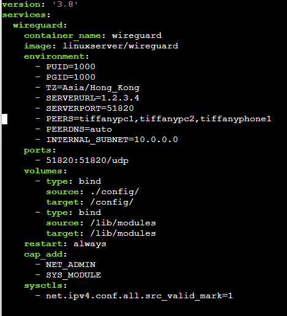

### Create a digital ocean server with a non-root user with sudo permissions

Generate a droplet
- ubuntu 22.04 LTS x64; SFO3; 0.04/month
- adduser tiffany
- sudo usermod -aG sudo tiffany

[install docker](https://thematrix.dev/install-docker-and-docker-compose-on-ubuntu-20-04/)
- follow this and install docker

- mkdir -p ~/wireguard/config/
- nano ~/wireguard/docker-compose.yml

- copy and paste this into the .yml file
- change serverlurl to DO server ip
- edit the peers as needed

starting wireguard
- cd ~/wireguard/
- sudo docker-compose up -d
- sudo docker-compose logs -f wireguard
  - this will output all the qr codes for the peers you created. 

add tunnel to wireguard
- sftp the .conf file to client machine
- locate the file on wireguard tunnel
