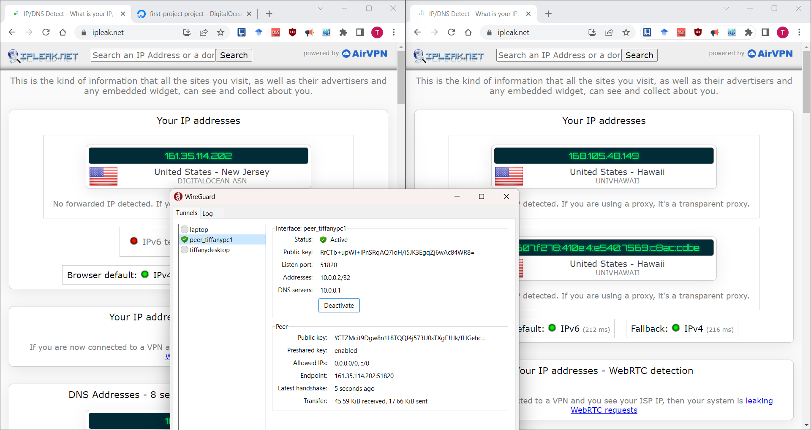

Create a digital ocean server

Generate a droplet
- ubuntu 22.04 LTS x64; SFO3; 0.04/month
- adduser tiffany
- sudo usermod -aG sudo tiffany

 create a non-root user with sudo permissions
- adduser tiffany
- usermod -aG sudo tiffany
- sudo su tiffany

[install docker](https://thematrix.dev/install-docker-and-docker-compose-on-ubuntu-20-04/)

Install docker
- sudo apt install docker-compose

- mkdir -p ~/wireguard/config/
- nano ~/wireguard/docker-compose.yml

- copy and paste this into the .yml file
- change serverlurl to your DO server ip
- edit the peers as needed

starting wireguard
- cd ~/wireguard/
- sudo docker-compose up -d
- sudo docker-compose logs -f wireguard
  - this will output all the qr codes for the peers you created. 

Locate the config file
- sftp -P 41235 tiffany@147.182.232.139:algo/configs/147.182.194.171/wireguard/laptop.conf ~/

Install config file 
- sudo install -o root -g root -m 600 <username>.conf /etc/wireguard/wg0.conf
    - i used laptop.conf in the previous command

## Wireguard on pc
Download wireguard and setup
- add tunnel and find the .conf file previously downloaded

add tunnel to wireguard
- sftp the .conf file to client machine
- locate the file on wireguard tunnel

